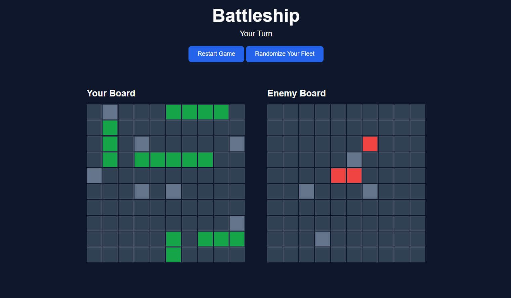

# ⚓ Battleship

A modern implementation of the classic **Battleship** game built with **JavaScript**, **Webpack**, and **Test-Driven Development (TDD)** using **Jest**.

This project was developed focusing on object-oriented programming, modular architecture, testing, and DOM manipulation.

---

## 📸 Screenshot





---

## ✨ Features

- 🎮 Play Battleship against a computer opponent
- ⚓ Multiple ships with different lengths
- 🎯 Click enemy board to attack
- 🤖 Computer AI performs random valid attacks
- 🚫 Prevents duplicate attacks
- 💥 Hit and miss indicators
- 🏆 Automatic winner detection
- 🔄 Restart game anytime
- 📱 Responsive layout
- 🧪 Unit tested with Jest

---

## 🛠 Built With

- HTML5
- CSS3
- JavaScript (ES6 Modules)
- Webpack
- Babel
- Jest

---

## 📂 Project Structure

```
battleship/
│
├── src/
│   ├── game.js
│   ├── gameboard.js
│   ├── player.js
│   ├── ship.js
│   ├── ui.js
│   ├── index.js
│   ├── style.css
│   └── template.html
│
├── tests/
│   ├── ship.test.js
│   ├── gameboard.test.js
│   └── player.test.js
│
├── images/
├── webpack.config.cjs
├── babel.config.js
├── package.json
└── README.md
```

---

## 🧪 Running Tests

Install dependencies:

```bash
npm install
```

Run Jest:

```bash
npm test
```

Watch mode:

```bash
npm test -- --watch
```

---

## ▶️ Installation

Clone the repository:

```bash
git clone https://github.com/salman61101/battleship_Js.git
```

Navigate into the project:

```bash
cd battleship
```

Install dependencies:

```bash
npm install
```

Start the development server:

```bash
npm start
```

Build for production:

```bash
npm run build
```

---

## 🎯 Gameplay

1. Launch the application.
2. Both players receive ships.
3. Click any square on the enemy board to attack.
4. Hits and misses are displayed immediately.
5. The computer automatically makes its move.
6. Continue until one fleet is completely destroyed.
7. Press **Restart Game** to play again.

---

## 🧠 Concepts Practiced

This project strengthened my understanding of:

- Object-Oriented Programming
- Factory Functions & Classes
- Test-Driven Development (TDD)
- Unit Testing with Jest
- Modular JavaScript
- ES6 Modules
- Webpack
- Babel
- DOM Manipulation
- Event Handling
- Game Logic
- State Management
- Randomized Algorithms

---

## 📚 What I Learned

While building this project I learned how to:

- Design scalable JavaScript applications
- Write unit tests before implementation
- Separate business logic from UI logic
- Create reusable modules
- Build interactive browser games
- Manage application state efficiently
- Debug complex JavaScript applications

---

## 🔮 Future Improvements

- Drag & Drop ship placement
- Smarter computer AI
- Ship rotation before placement
- Multiplayer mode
- Sound effects
- Animations
- Difficulty levels
- Mobile touch optimizations
- Scoreboard
- Save game progress

---

## 👨‍💻 Author

**Salman**

GitHub: https://github.com/salman61101

---

## 🙏 Acknowledgements

- The Odin Project
- Jest Documentation
- Webpack Documentation
- MDN Web Docs

---

## 📄 License

This project is licensed under the MIT License.
